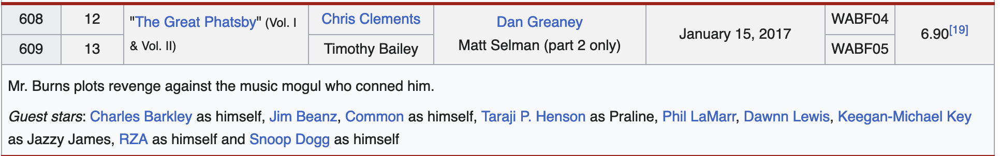
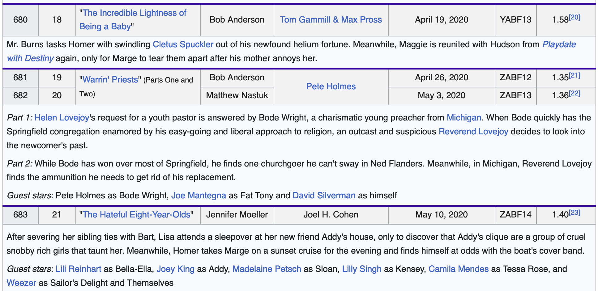
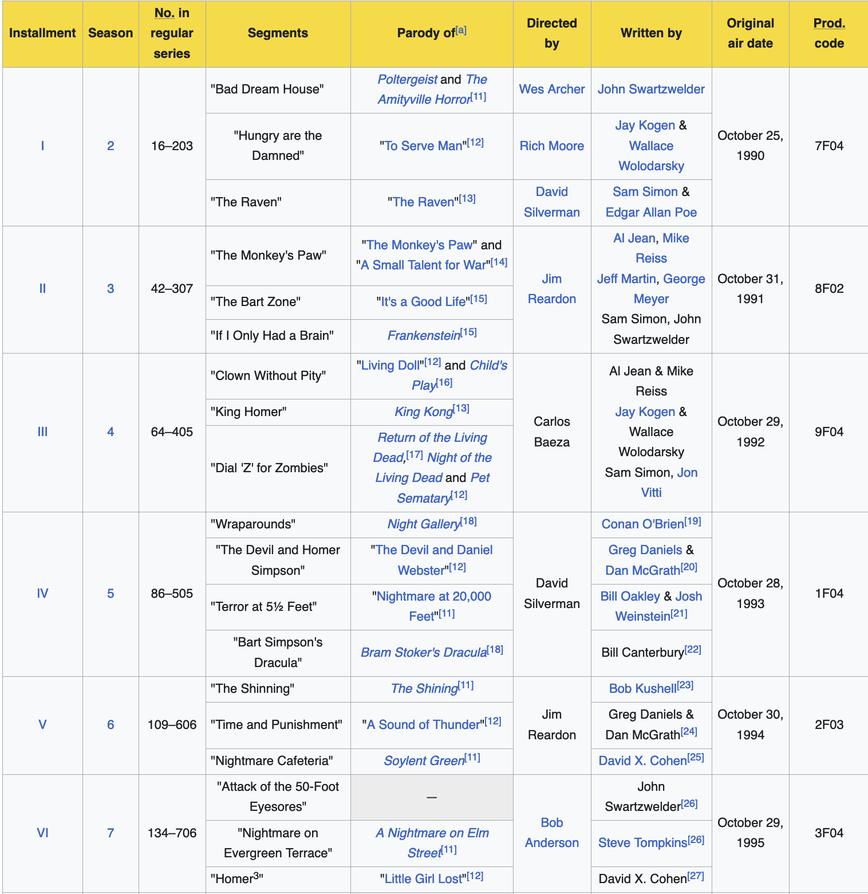

---
title: "Simpsons Episode Analysis"
author: "Richard Luu"
output: html_document
---

```{r setup, include=FALSE}
knitr::opts_chunk$set(echo = TRUE)
library(readr)
library(tidyverse)
library(ggplot2)
library(dplyr)
library(lubridate) # Timestamp date
library(plotly)
library(stringr)
library(glue)
library(grid)
library(gridExtra)
library(RColorBrewer)
library(wordcloud)
library(wordcloud2)
library(tm) #corpus


#library(lattice)
#library(tibble)
#library(mice) #md.pattern
#library(DT)
```

```{css, echo=FALSE}
<style type="text/css">
    ol { list-style-type: upper-alpha; }
</style>
```

```{r Load Data, include=FALSE}
#data <- read_csv("episode_data/simpsons_episodes.csv", show_col_types = FALSE)
data <- read_csv("episode_data/simpsons_episodes.csv")
```

<link rel="stylesheet" href="https://kit.fontawesome.com/d22460e4b2.css" crossorigin="anonymous">

# Preface

This is an updated/overhauled case study on The Simpsons episodes as the data set has been more throughouly updated since last worked on. Previous observations and analysis done will mostly carry over but some parts will be adapted to the newer, cleaner, data set. Prior observations have also been trimmed to make this document more concise.

- Specific references to season and episode short hand is: S##E## (Season #, Episode #).
- Most plots will be interactive and have hover-able elements to inspect specific values.
- Observational claims not valid until stated/statistically proven otherwise.
  - e.g. "The average rating of Season 2 is greater than Season 7" is just a mere observation. 
  
--- 
  
# Data Source

- Data obtained from [Kaggle](https://www.kaggle.com/datasets/jonbown/simpsons-episodes-2016)
- Author credits IMDB, The Movid Database, and Wikipedia. 
- While investigating, Wikipedia also has Nielsen ratings
  - Can scrape and do t-tests to compare whether or not Nielsen ratings significantly different from IMDb
  
---

# Exploratory Data Analysis

```{r class.source = 'fold-show', EDA}
dim(data)
names(data)
summary(data)
sum(is.na(data))
head(data) %>% rmarkdown::paged_table()
```

**Things of Note**:

- Most variables are in some way viable as predictor variable.
  - i.e. Use description text for text analysis (frequency, sentiment, etc.) as opposed to completely ignoring.
  - `number_in_season` being an interesting one as number of episodes of per (earlier) seasons ranged from 13 to 25.
    - Standard 22 episodes per season is adopted later.
- No variable for episode run time.
  - Can assume ~22 mins per avg run time for 30 minute T.V. slot.
  - Run time of actual content would fluctuate due to variability of couch gags and ending credits.
- Air date was originally considered with prior knowledge of the [Friday night death slot](https://en.wikipedia.org/wiki/Friday_night_death_slot) which is where low rating shows are rescheduled to air that are pending cancellation.
  - Can assume might not be too relevant due to popularity of the show and fixed airing schedule. 
  - Wikipedia lists broadcasting history which includes time slot(s).
- Ratings will be most interesting to analyze/use as an independent variable.
  - Two sources of ratings, can run t-test to compare if statistically different. For the sake of inital analysis, IMDb ratings will be used instead due to presumed greater sample size and reputation.
  
```{r No TMBD, include=FALSE}
data <- select(data, -c('tmdb_rating', 'tmdb_vote_count')) #, 'production_code'))
```

```{r New Variables, include=FALSE}
desc_split <- strsplit(data$description, " ")
len_desc <- sapply(desc_split, function(x) sum(str_count(x, "\\S+"))) 
age <- difftime("2023-06-01", data$original_air_date)
data$len_desc <- len_desc
data$age <- age
```

- Adding two new variables:
  - `length_description` and `age` (time since original air date).
    - `age` will be based off a fixed date of June 1st, 2023 in which Season 34 has finished airing new episodes.
    - As a point of reference, new seasons premiere around [late September](https://en.wikipedia.org/wiki/List_of_The_Simpsons_episodes)

**Initial Observations Based Off of Summary Statistics**:

  - 747 x 14 table
  - 747 episodes, 34 seasons
    - The show has been renewed until [Season 35](https://www.npr.org/2023/01/27/1151957905/fox-has-renewed-the-simpsons-through-2025).
  - First episode air date: 12-17-1989 
    - Pilot episode where the family adopts the family dog (Santa's Little Helper).
  - Lowest rating 4.0, but note IMDB ratings skewed / bias by nature
```{r len_desc Summary}
summary(data$len_desc)
```
  - Shortest episode description length is five words:
    ```{r Short len_desc, echo=FALSE}
    short_len <- which(data$len_desc == 5)
    data$description[short_len]
    ```

**Potential Error(s) In the Data**:

1. No blatant missing values as noted above but some numeric values listed as different type 
    - `us_viewers_in_million` is `char` type
    - Variable will be renamed to `viewers` for ease of access
    
2. Not observed in above summary statistics, but there are unique cases where The Simpsons has two-part episodes. This updated data set is assumed to not account for the differences as each part (might) have a different viewer count, writers/directors, etc.
    - [Four cases](https://simpsonswiki.com/wiki/Category:Two-part_episodes) in which entries need to be fixed.
  
**Preliminary Questions/Notes**:

The following are ways the data could be additionally analyzed and explored outside of given data set that will require external data.

- Potential filter data by:
  - Treehouse of Horror episodes (Halloween specials)
  - First and last episodes of each season
- New external data points to consider:
  - Disney acquisition of Hulu/Fox, and FX [(March 19-20, 2019)](https://en.wikipedia.org/wiki/Acquisition_of_21st_Century_Fox_by_Disney)
  - Sociopolitical/culture events (e.g. Presidential election episodes)
  - Pre vs Post The Simpsons movie release (July 27, 2007)

---

## Data Error Discussion

**1. US Viewers in Millions**

```{r US Viewers, class.source = 'fold-show'}
data$viewers <- as.numeric(data$us_viewers_in_millions)
which(is.na(as.numeric(data$viewers)))
data[423, c('id','title', 'viewers')]
```

```{r Viewer Fix, echo=FALSE}
data[423,]$viewers = 8.09
```

- Simply re-factor variables to `as.numeric()` for further application
- Missing data points were originally missed because of type issue
  - `is.na()` didn't detect because it was of class/type `char`
  - Viewership data is listed on Wikipedia (8.09 mil.), presumed to be updated on there prior to newest data version
- However, an interesting observation was made; Wikipedia articles report viewership in both individual viewers and viewing households
  - Seasons 1–11 are ranked by households (in millions), Seasons 12–33 are ranked by total viewers (in millions).
  - This does skew the data as seen in the increase in average viewership between Season 11 and 12.

```{r viewership reports, echo=FALSE}
aggregate(data$viewers,list(data$season), FUN=mean)[9:13,]
```
    

---

**2. Two-Part Episodes**
    
The four unique cases are:

- In a previous version it was observed that the author scrapped the data improperly most likely due to Wikipedia table formatting. This did cause inconsistencies in the data when comparing to Wikipedia.

- Who Shot Mr. Burns? (Part One)" (S6 Finale, S7 Pilot) (id: 127, 128)
- The Great Phatsby (S28E12-13) (id: 607)
- Warrin' Priests (S31E19-20) 
- A Serious Flanders (S33E06-07)

```{r Move Column, include=FALSE}
data <- data %>% relocate('number_in_series')
```


```{r Two Part Episodes, A, echo=FALSE}
subset(data, subset = id %in% c(127, 128)) %>% rmarkdown::paged_table()
```

There are no present issues in this pair of episodes as they are treated as two separate entities.

```{r Two Part Episodes, B, echo=FALSE}
subset(data, subset = id %in% c(606, 607, 608)) %>% rmarkdown::paged_table()
```

However, the following is a more unique case considering how it is the 'first two-part episode of the series since "Who Shot Mr. Burns?", though it was promoted and aired as the show’s first hour-long episode in its initial airing.

On Disney+, Vol. I and Vol. II are one episode, episode 12, with a total running time of 44 minutes, with no episode 13 listed in the series.'^[https://en.wikipedia.org/wiki/The_Great_Phatsby]

It is worth noting that both parts have different production codes and credits but the same premiere date. Thus, this special will be considered a single episode.

If the episode were to be split, the remaining data would have to be shifted (id, number_in_season/series).

  - Can also use `number_in_series` to identify episodes, `id` is for sake of indexing that author used.



```{r Two Part Episodes, C, echo=FALSE}
subset(data, subset = id %in% c(678, 679, 680)) %>% rmarkdown::paged_table()
```

Note: The episode descriptions are from IMDb, not Wikipedia thus the discrepancy. The credits section on IMDb does not show who wrote the episode, only the developers.

- - -


- - -

Since this special is not promoted and treated as a single episode, it will be treated as two different episodes. As seen when comparing the IMDb episodes versus the data snippet, the descriptions do not line up with each other. The data will be fixed and updated accordingly. This error is also present in the next observation; i.e. Comparing the "The Hateful Eight-Year-Olds" description on Wikipedia, to IMDb, to the table.



- - -

```{r New Data, include=FALSE}
#new_data <- read_csv("episode_data/episodes_fixed.csv")
new_data <- read_csv("episode_data/simpsons_final.csv")

new_data$viewers <- as.numeric(new_data$us_viewers_in_millions)
desc_split <- strsplit(new_data$description, " ")
len_desc <- sapply(desc_split, function(x) sum(str_count(x, "\\S+"))) 

new_data$original_air_date <- as.POSIXct(new_data$original_air_date, format="%Y-%m-%d")

age <- difftime("2023-06-01", new_data$original_air_date)
new_data$len_desc <- len_desc
new_data$age <- age
new_data$season <- as.factor(new_data$season)

summary(new_data)
```

- - -

## Graphs

Note: Graphs expected to fall under time series analysis, and using `id`/`original_air_date`/`age` are somewhat interchangeable since they are effectively factors/'categorical.'

### Seasons Data

#### Seasons vs Ratings {.tabset}

##### Boxplot

```{r Seasons Graphs, echo=FALSE}
rating_v_season <- ggplot(data = new_data, aes(x = season, y = imdb_rating, group=season, color=season)) + geom_boxplot() + ggtitle("IMDB Rating vs Simpsons Seasons") + xlab("Season") + ylab("Rating") + 
  scale_y_continuous(name="IMDB Rating",limits=c(4, 10))
ggplotly(rating_v_season)
```

##### Scatterplot

```{r Season Rating Scatter, echo=FALSE}
rating_jitter <- ggplot(new_data,aes(x=season, y= imdb_rating, color=season)) + geom_jitter(alpha=0.5) + ggtitle("IMDB Rating vs Simpsons Seasons") + xlab("Season") + ylab("Rating") + scale_y_continuous(name="IMDB Rating",limits=c(4, 10))
ggplotly(rating_jitter)
```

##### Boxplot w/ Jitter

```{r Season Jitter, echo=FALSE}
rating_jitter <- ggplot(new_data,aes(x=season, y= imdb_rating, color=season)) + geom_boxplot() + geom_jitter(alpha=0.5) + ggtitle("IMDB Rating vs Simpsons Seasons") + xlab("Season") + ylab("Rating") + scale_y_continuous(name="IMDB Rating",limits=c(4, 10))
ggplotly(rating_jitter)
```

##### Averages

```{r Seaason v Rating Avg, echo=FALSE}
season_avg <- new_data %>% group_by(season) %>% summarise(season_avg = mean(imdb_rating))
avg_vs_season <- ggplot(data = season_avg, aes(x = as.numeric(season), y = season_avg)) + 
  geom_line(data = season_avg, aes(x = as.numeric(season), y = season_avg)) + geom_point() +
  ggtitle("Average IMDB Rating vs Simpsons Season") + xlab("Season") + ylab("Average IMDB Rating")
ggplotly(avg_vs_season)
```

- When looking solely at the averages, a negative pattern is more definitive.
- Season 30 has a large drop off from 29, then recovers the following seasons.
  - Comparable to Season 8 and the more steep decline.

#### {-}

Note: Y-Axis scaled from 4-10 to trim excess white space.

- Seasons with large spread: 8, 23, and potentially 33
- S8 has highest maximum, alternatively S23 has lowest:
  - S08E23: [Homer's Enemy](https://en.wikipedia.org/wiki/Homer%27s_Enemy)
  - S23E23: [Lisa Goes Gaga](https://en.wikipedia.org/wiki/Lisa_Goes_Gaga)

- Ratings seem to plateau as seasons progress, but the occasional outlier does exist. 

- - - 


#### Seasons vs Viewers {.tabset}

##### Boxplot

```{r BoxPlot-SeasonVsViewer, echo=FALSE}
viewer_v_season <- ggplot(data = new_data, aes(x = season, y = as.numeric(viewers), color=season)) +
  geom_boxplot() + ggtitle("Viewers vs Simpsons Seasons") + xlab("Season") + ylab("Viewers (p/ mil)") +
  theme(legend.position = "none")
ggplotly(viewer_v_season)
```

##### Scatterplot

```{r Scatter Viewers, echo=FALSE}	
tempJitter <- ggplot(new_data,aes(x=season, y= viewers, color=season)) + geom_jitter(alpha=0.5) +
  ggtitle("Viewers vs Simpsons Seasons") + xlab("Season") + ylab("Viewers (p/ mil)") +
  theme(legend.position = "none")
ggplotly(tempJitter)
```

##### Boxplot w/ Jitter

```{r Jitter Viewers, echo=FALSE}	
tempJitter <- ggplot(new_data,aes(x=season, y= viewers, color=season)) + geom_boxplot() +
  geom_jitter(alpha=0.5) + ggtitle("Viewers vs Simpsons Seasons") + xlab("Season") + ylab("Viewers (p/ mil)") + theme(legend.position = "none")
ggplotly(tempJitter)
```

##### Averages

```{r Season v Viewers Avg, echo=FALSE}
season_avg <- new_data %>% group_by(season) %>% summarise(season_avg = mean(viewers))
avg_vs_season <- ggplot(data = season_avg, aes(x = as.numeric(season), y = season_avg)) + geom_point() + geom_line() + 
  ggtitle("Average IMDB Rating vs Simpsons Season") + xlab("Season") + ylab("Average Viewer (p/ mil)")
ggplotly(avg_vs_season)
```

- Similar to looking at averages, when observing only the averages, a negative pattern is more definitive.
- Season 11 drop and recovery is an interesting outlier as it is much more steep of a drop.
  - This season included an episode where they killing-off of a recurring character, Maude Flanders.

---

#### {-}

- Viewership does seemingly appear to decrease over time.
- More outliers exist for maxima rather than minima.
  - Two cases (S01 and S13) where the outlier are minima
  - Most extreme case of maximum in [S16 E8](https://en.wikipedia.org/wiki/Homer_and_Ned%27s_Hail_Mary_Pass)
    - Interesting to see how rest of maxima not even close to same viewership
    - Gap between the maximum and third quantile is largest compared to the other seasons
    - Why is it this specific episode that makes it an outlier?
      - Air date, [Feb 6, 2005](https://www.onthisday.com/date/2005/february/6) which is when Super Bowl XXXIX happened alongside with the premiere of another FOX animated series, American Dad.
    
- Outliers in the ratings graph(s) are more interesting to look at when compared to `viewers` due to more variability.
- The ratings do not seem to follow a negative trend like the viewership.

---

### Episode Data

#### Ratings {.tabset}

##### Plot
```{r Rating vs Episode, echo=FALSE}
(rating_v_episode <- ggplot(data = new_data, aes(x = id, y = imdb_rating, col = season, shape = season)) + geom_point() + ylab("Rating") + xlab("Episode Number") + ggtitle("Rating vs Episode") +
  geom_line() + scale_shape_manual(values = rep(0:14, 3)) + scale_y_continuous(name="IMDB Rating", limits=c(4,10)))
```

##### Interactive Plot
```{r Rating v Episode plotly, echo=FALSE}
ggplotly(rating_v_episode)
```

#### {-}

- General negative trend as expected per the seasonal graph(s)
  - Start / end of season no notable patterns of yet granted it is somewhat hard to observe
    - More detailed graph(s) later
  - i.e. Season premiere vs finale (Presumably because of episodic nature of the series and no overarching plotline)
  
#### Viewers {.tabset}

##### Plot
```{r Viewer v Episode, echo=FALSE}
(viewer_v_episode <- ggplot(data=new_data,aes(x=id, y=viewers, col=season, shape=season)) + 
   geom_point() + ylab("Viewer") + xlab("Episode Number") + ggtitle("Episode vs Viewer") + 
   geom_line() + geom_line() + scale_shape_manual(values = rep(0:14, 3)))
```

##### Interactive Plot 
```{r View v Epiosde Plotly, echo=FALSE}
ggplotly(viewer_v_episode)
```

#### {-}

- Can see more detailed info when zoomed in accordingly; however, graph is still too condensed to get detailed view
- Overall trend does show that rating does plateau (as expected from seasonal boxplots)

---

### Season Specific Episode Data {.tabset}
```{r Season Specific, include=FALSE, echo=FALSE}
THOH <- new_data %>% filter(str_detect(title, 'Treehouse of Horror'))

get_season <- function(season_num) {
  tempDF <- new_data %>% filter(season == season_num)
  return(tempDF)
}

set1 <- c()
set2 <- c()
set3 <- c()
set4 <- c()

for (i in 1:9) {
  temp <- get_season(i)
  #tempGG <- ggplot(temp, aes(x = id, y = viewers)) + geom_point() +
  #  ggtitle(glue('Season {i}')) + xlab("Episode") + ylab("Viewers")
  highlight_g <- data.frame(temp[1,])
  highlight_g[2, ] <- tail(temp, n=1)
  temp_thoh <- THOH[THOH$season == i,]
  
  tempGG <- ggplot(temp, aes(x = id, y = viewers), col="black") + geom_point() + 
    ggtitle(glue('Season {i}')) +  xlab("Episode") + ylab("Viewers") + 
    geom_line() +
    geom_point(data=highlight_g, aes(x = id, y = viewers), col="red", size=2) +
    geom_point(data=temp_thoh, aes(x = id, y = viewers), col="green", size=2) +
    geom_line()
  
  set1[[i]] <- tempGG
}

tempIndex <- 1
for (i in 10:18) {
  temp <- get_season(i)
  #tempGG <- ggplot(temp, aes(x = id, y = viewers)) + geom_point() +
  #  ggtitle(glue('Season {i}')) + xlab("Episode") + ylab("Viewers")
  highlight_g <- data.frame(temp[1,])
  highlight_g[2, ] <- tail(temp, n=1)
  temp_thoh <- THOH[THOH$season == i,]
  
  tempGG <- ggplot(temp, aes(x = id, y = viewers)) + geom_point() + 
    ggtitle(glue('Season {i}')) + xlab("Episode") + ylab("Viewers") + 
    geom_line() +
    geom_point(data=highlight_g, aes(x = id, y = viewers), col="red", size=2) +
    geom_point(data=temp_thoh, aes(x = id, y = viewers), col="green", size=2) 
  
  set2[[tempIndex]] <- tempGG
  tempIndex <- tempIndex + 1
}

tempIndex <- 1
for (i in 19:27) {
  temp <- get_season(i)
  #tempGG <- ggplot(temp, aes(x = id, y = viewers)) + geom_point() +
  #  ggtitle(glue('Season {i}')) + xlab("Episode") + ylab("Viewers")
  highlight_g <- data.frame(temp[1,])
  highlight_g[2, ] <- tail(temp, n=1)
  temp_thoh <- THOH[THOH$season == i,]
  
  tempGG <- ggplot(temp, aes(x = id, y = viewers)) + geom_point() +
    ggtitle(glue('Season {i}')) + xlab("Episode") + ylab("Viewers") +
    geom_line() + 
    geom_point(data=highlight_g, aes(x = id, y = viewers), col="red", size=2) +
    geom_point(data=temp_thoh, aes(x = id, y = viewers), col="green", size=2)
  
  set3[[tempIndex]] <- tempGG
    tempIndex <- tempIndex + 1
}

tempIndex <- 1
for (i in 28:34) {
  temp <- get_season(i)
  #tempGG <- ggplot(temp, aes(x = id, y = viewers)) + geom_point() +
  #  ggtitle(glue('Season {i}')) + xlab("Episode") + ylab("Viewers")
  highlight_g <- data.frame(temp[1,])
  highlight_g[2, ] <- tail(temp, n=1)
  temp_thoh <- THOH[THOH$season == i,]
  
  tempGG <- ggplot(temp, aes(x = id, y = viewers)) + geom_point() +
    ggtitle(glue('Season {i}')) + xlab("Episode") + ylab("Viewers") + 
    geom_line() +
    geom_point(data=highlight_g, aes(x = id, y = viewers), col="red", size=2) +
    geom_point(data=temp_thoh, aes(x = id, y = viewers), col="green", size=2) 
  
  set4[[tempIndex]] <- tempGG
    tempIndex <- tempIndex + 1
}
```
#### Group 1 (S01 - S09)
```{r Seasonal Plots vs Episode, 1, echo=FALSE}
grid.arrange(grobs = set1, ncol = 3, nrow=3)
```

#### Group 2 (S10 - S18)
```{r Seasonal Plots vs Episode, 2, echo=FALSE}
grid.arrange(grobs = set2, ncol = 3, nrow=3)
```

#### Group 3 (S19 - S27)
```{r Seasonal Plots vs Episode, 3, echo=FALSE}
grid.arrange(grobs = set3, ncol = 3, nrow=3)
```

#### Group 4 (S28 - S34)

```{r Seasonal Plots vs Episode, 4, echo=FALSE}
grid.arrange(grobs = set4, ncol = 3, nrow=3)
```

### {-}

```{r asd, echo=FALSE}
```
- Note: Green highlights are Treehouse of Horror (THOH) episodes.
- Just rough estimations/observations, but note that overall trend is generally decrease in score.
- Not surprising as noted earlier as _The Simpsons_ is not a series with over arching season plot line.
- S1 does not have a THOH episode.
- THOH episodes within first five episodes per season, some cases where it is first episode of the season.
- In general THOH seem to be in upper half of viewership per season
- Seasons where THOH episodes highest of the respective Season: 5, 6 15 (?), 17, 19, 20, 32, 33


### THOH {.tabset}

#### Ratings

```{r THOH Ratings, echo=FALSE, warning=FALSE}  
#THOH <- new_data %>% filter(str_detect(title, 'Treehouse of Horror'))

THOH_Ratings <- ggplot(data = new_data, aes(x = id, y = imdb_rating)) + geom_point() +
  geom_point(data = THOH, aes(x = id, y = imdb_rating, col = "", text=season) ) + 
  ggtitle("Treehouse of Horror Specials") + ylab("IDMB Rating") + labs(col="THOH") + theme(legend.position="none")

ggplotly(THOH_Ratings)
```


#### Viewers
```{r THOH Viewers, echo=FALSE, warning=FALSE}
THOH_Viewers <- ggplot(data = new_data, aes(x = id, y = (viewers))) + geom_point() +
  geom_point(data = THOH, aes(x = id, y = (viewers), col = "", text=season)) + 
  ggtitle("Treehouse of Horror Specials") + ylab("Viewers (p/ mil)") + labs(col="THOH") + theme(legend.position="none")
ggplotly(THOH_Viewers)
```

### {-}

- The ratings of THOH specials remain neutral after the initial drop, then fluctuate after the ~400th episode.
- The 29th THOH special (Season 30) is lowest for both ratings and viewer.

---

## Writers and Directors


```{r Writers, echo=FALSE, include=FALSE}
#simpsons <- simpsons %>% rename(rating = imdb_rating)
#simpsons <- simpsons %>% rename(directors = directed_by)
#simpsons <- simpsons %>% rename(writers = written_by)
names(new_data)[names(new_data) == 'written_by'] <- 'writers'
names(new_data)[names(new_data) == 'directed_by'] <- 'directors'
```

```{r Unique Names, class.source = 'fold'}
length(unique(new_data$writers))
length(unique(new_data$directors))
```
- 166 unique writers records.
  - Some entries have multiple people, i.e. outliers mentioned above, 2 part episodes.
  - The way data obtained caused errors/inconsistencies within data.
    - Scrapped using different delimiters (&, spaces, or no space at all).
    - Some entries scraped including "Story by:" and/or "Teleplay by:".
      - Different semantics based off the WGA. (How did WGA Strike of 07 affect episode metrics?)
        - Treating both titles as a writer to look for unique names.
      - e.g. id == 176
      
      ```{r ID 176, echo=FALSE}
       new_data[new_data$id==176,]$writers
      ```
- 49 unique director listings 

```{r Writers-Clean, class.source = 'fold', echo=FALSE}
writers <- data.frame("writers" = new_data$writers, "length"= nchar(new_data$writers))
head(unique(writers$writers))
length(unique(writers$writers))
mean(nchar(new_data$writers))

long_writer <- writers %>% filter(length >= 20)
short_writer <- writers %>% filter(length < 20)

# 1) Remove titles
no_story_by <- str_replace_all((long_writer$writers), 'Story\\sby\\s\\:\\s', '')
no_teleplay <- str_replace_all(no_story_by, 'Teleplay\\sby\\s\\:\\s', ' & ')

# 2) Split
replace_comma <- str_replace_all(no_teleplay, ',', ' &')
split_writers <- unlist(str_split(replace_comma, ' & '))

# 3) Remove side effects
writers_clean <- str_remove(split_writers, ('wraparound'))
writers_clean2 <- str_remove(writers_clean, ('\\(s\\)'))
```

- The 166 unique entries are mix of individual writers and groups/duos.
- First pass comparing to nchars (characters in name) to average length of writers names.
  - Upon further inspection some names of single writers of episode longer than average (15.63685 chars), did manual search and decided 20 characters is good cutoff.
  
- Otherwise 55 unique instance of episodes of multiple writers
  - 1st Pass: Removing 'Teleplay' / 'Story' titles 
  - 2nd Pass: Separating entries by delimiters
  - 3rd Pass: Cleaning side effects of using unlist function
  - 4th Pass: (Done)


### Writers {.tabset}


```{r writer-graphs, echo=FALSE}
all_names <- c(writers_clean2, short_writer$writers)
length(unique(all_names))
names_count <- data.frame(base::table(all_names))
tail(names_count[order(names_count$Freq),])
```
- ~~Unique writers cut down to 155 which is still more than what I expected from the initial 166~~

- NOTE: Wikipedia has a [list of The Simpsons writers](https://en.wikipedia.org/wiki/List_of_The_Simpsons_writers) (assumed to be correct) which for the most part is consistent up with the parsed data. However, the way THOH episodes are listed on Wikipedia affected how the data was scraped. The episodes act as an anthology, thus have different writers for each part and listed as separate tables. In the data set, it only included the writer credits for the first segment. In the following images, compare listings for the second THOH episodes.


```{r THOH Investigate, echo=FALSE}
head(THOH[,c('title', 'written_by')]) %>% rmarkdown::paged_table()
```




Take note of how the writers are both separated per segment or listed all together. It is assumed the author of the data set collected the data per season Wikipedia page as it it included other metrics in the data set. i.e. Scraped data off of https://en.wikipedia.org/wiki/The_Simpsons_(season_X), X being each season number.

Thus to coninute, the table of writers from Wikipedia will be used. Some writers only worked with other writers and have no individual credits, so duos/groups will be treated as a single entity.

#### Bar Graph

```{r Wikipedia Writers, echo=FALSE}
wiki_writers <- read_csv("episode_data/simpsons_writers.csv")
ggplotly(ggplot(data=wiki_writers, aes(x = Frequency)) + geom_bar() + xlab("Number of Episodes Written") + ylab("Number of Writers") + ggtitle("Number of Episodes Written per Writer"))
tail(wiki_writers[order(wiki_writers$Frequency),])
```

#### Pie Chart

```{r Writers, Pie, echo=FALSE}
freq_df <- data.frame(table(wiki_writers$Frequency))

fig <- plot_ly(freq_df, labels=~Var1, values=~Freq)
fig <- fig %>% add_pie(hole = 0.6)

fig <- fig %>% layout(title = "Episodes Written Frequency",  showlegend = F,
                      xaxis = list(showgrid = FALSE, zeroline = FALSE, showticklabels = FALSE),
                      yaxis = list(showgrid = FALSE, zeroline = FALSE, showticklabels = FALSE))

fig
```

### {-}

- Almost half of data is telling us that many writers only contributed to a single episode
- One writer, John Swartzwelder, has written for 59 (max) episodes while second highest is 37 by John Frink

---

#### Directors {.tabset}

The issue persisted with directors, so the Wikipedia table for directors will be used.

##### Bar Graph
```{r Directors, echo=FALSE}
wiki_directors <- read_csv("episode_data/simpsons_directors.csv")
length(unique(wiki_directors$Director))
tail(wiki_directors[order(wiki_directors$Freq),])

ggplotly(ggplot(data=wiki_directors, aes(x = Freq)) + geom_bar() + xlab("Number of Episodes Directed") + ylab("Number of Directors") + ggtitle("Number of Episodes Directed per Director"))

```

##### Pie Chart

```{r Pie Directors}
freq_df <- data.frame(table(wiki_directors$Freq))
freq_df <- freq_df %>% rename(EpisodesDirected = Var1)

fig <- plot_ly(freq_df, labels=~EpisodesDirected, values=~Freq)
fig <- fig %>% add_pie(hole = 0.6)
fig <- fig %>% layout(title = "Episodes Directed Frequency",  showlegend = FALSE,
                      xaxis = list(showgrid = FALSE, zeroline = FALSE, showticklabels = FALSE),
                      yaxis = list(showgrid = FALSE, zeroline = FALSE, showticklabels = FALSE))
fig
```

#### {-}

- 41 unique directors
- 12.2% of unique directors only directed one episode, while most common value is seven episodes directed.
- One director, Mark Kirkland, has directed for 84 episodes, second highest is 82 by Steven Dean Moore.
  - Difference compared to writer difference between top two isn't as large when comparing to writers.


```{r Combination}
as.numeric(unique(wiki_writers$Writer) %in% unique(wiki_directors$Director))
which(as.numeric(unique(wiki_writers$Writer) %in% unique(wiki_directors$Director)) == 1)
unique(wiki_writers$Writer)[120]
```
- For sake of curiosity, there is one overlap present between writers and directors.
  - One entry, David Silverman.
  
### Descriptions

```{r Desc Data, echo=FALSE}
text <- unlist(new_data$description) # Create a corpus  
docs <- Corpus(VectorSource(text))

docs <- docs %>%
  tm_map(removeNumbers) %>%
  tm_map(removePunctuation) %>%
  tm_map(stripWhitespace)
docs <- tm_map(docs, content_transformer(tolower))
docs <- tm_map(docs, removeWords, stopwords("english"))

dtm <- TermDocumentMatrix(docs) 
matrix <- as.matrix(dtm) 
words <- sort(rowSums(matrix),decreasing=TRUE) 
df <- data.frame(word = names(words),freq=words)

#wordcloud(words = df$word, freq = df$freq, min.freq = 1,
          #max.words=200, random.order=FALSE, rot.per=0.35,
          #colors=brewer.pal(8, "Dark2"))

wordcloud2(data=df, size=1, color='random-dark')
```

```{r WordShape, include=FALSE}
#wordcloud2(df, figPath = "/Users/richardluu/Desktop/homer2.png", size=1.4, color="black", backgroundColor = 'yellow')
```


